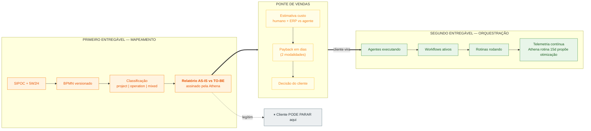
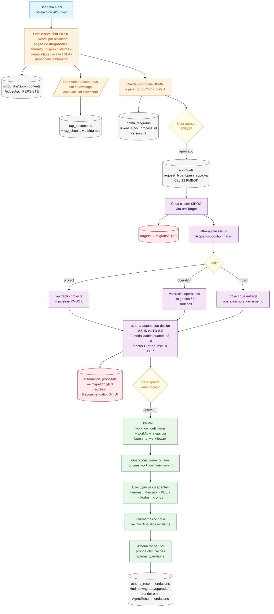
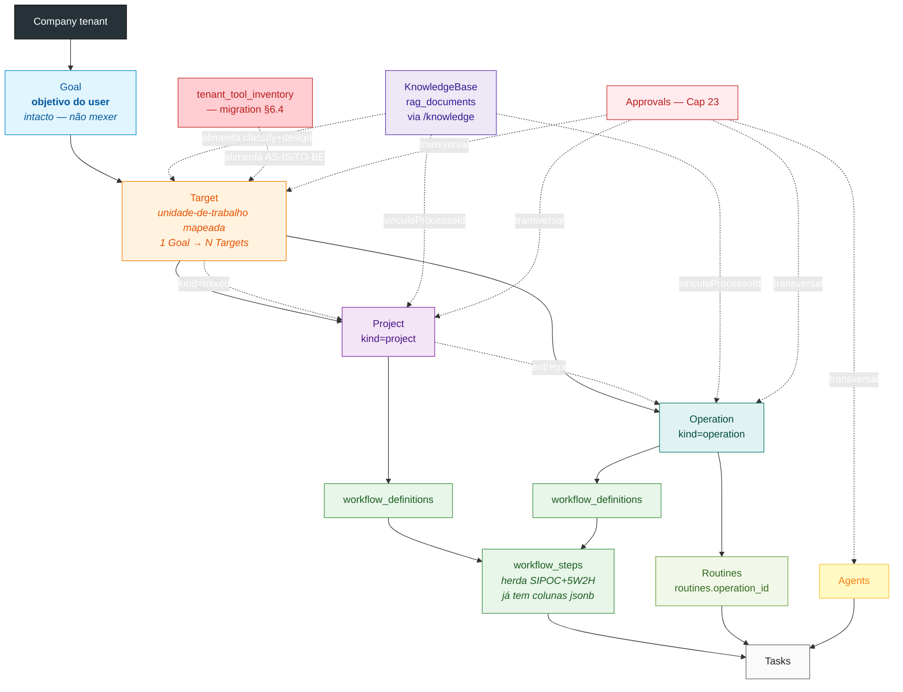

# ADR — Pipeline MAPEAR → ANALISAR → AUTOMATIZAR

> **Status:** registro consolidado da arquitetura existente + proposta de 4 migrations e roadmap em fases pendente de aprovação Marcelo
> **Owner:** Marcelo (autor do produto). Claude (registrador desta sessão).
> **Data:** 2026-05-17 (revisão 3 — incorpora cruzada inversa de 47 páginas × 70+ componentes existentes)
> **Origem:** após mergear PR #180 (athena-onboarding), Marcelo apresentou foto do livro **Heldman — Gerência de Projetos: Guia para o Exame Oficial do PMI, 3ª Ed.** com a mensagem literal:
>
> > "depois do cadastro vamos ter que terminar essa arte - Se não não teremos sucesso na logica"
>
> A discussão sucessiva expôs que **Claude vinha fazendo auditoria errônea da arquitetura existente** — propondo criar duplicatas de estruturas (e telas) já modeladas no produto. Este ADR DOCUMENTA o que Marcelo desenhou, registra os erros de leitura cometidos por Claude, e PROPÕE 4 migrations + 1 roadmap em fases pra fechar a malha. Decisões arquiteturais e de negócio são de Marcelo. Propostas Claude estão explicitamente marcadas como tal.

---

## 1. Verdade-base — o produto já estava desenhado

A varredura realizada nesta sessão (schema + 47 páginas frontend + 70+ componentes + 145 hooks + 133 endpoints REST + 6 services backend) confirmou que **quase toda a infraestrutura visível e operável já existe**. Esta seção registra o estado pré-existente.

### 1.1 Schema do banco (30+ tabelas relevantes em `vectraclip`)

| Domínio | Tabelas |
|---|---|
| Objetivos/Promoção | `goals` (kind, confidence, business_case_strength, **promoted_project_id**, pmoia_metadata, classified_at), `projects` (mission, status, lead_agent_id, target_date, issue_completion_pct) |
| Mapeamento estrutural | `sipoc_companies`, `sipoc_components`, `sipoc_edges`, `sipoc_positions`, `sipoc_processes`, `sipoc_raci`, `sipoc_sector_baselines`, `sipoc_sectors`, `sipoc_taxonomy_global` |
| Mapeamento de fluxo | `bpmn_diagrams` (linked_sipoc_process_id, linked_workflow_id, linked_goal_id, version, generated_by_task_id), `bpmn_diagram_versions` |
| Execução | `workflow_definitions` (trigger_type, cron_expression, version), `workflow_steps` (**suppliers, inputs, outputs, customers, decisions, five_w2h, sipoc_meta, responsavel, setor, sla_horas, requires_approval, alertas, ferramentas, logic_pattern, validation_status**), `workflow_trigger_types`, `workflow_logic_patterns` (taxonomy, json_skeleton, engine_handler), `routines` (**workflow_definition_id nullable**, schedule, agent_id, operation_type, prompt_template), `tasks` |
| Agentes | `agents`, `agent_specialties`, `agent_specialty_configs`, `agent_adapter_configs`, `agent_execution_configs`, `agent_execution_modes`, `agent_domains`, `agent_shared_config`, `agent_prompt_history` (version, recommendation_id, change_reason) |
| Governança | `approvals` (request_type, payload jsonb, status), `athena_recommendations` (kind, target_agent_id, proposed_changes_json, applied_history_id, triggered_by_goal_id), `audit_log` |
| Catálogos metadata-driven | `operation_types_catalog` (primary_agent_id, default_specialty_slug), `llm_models` (PK composta `(id, effective_from)` versionada por preço), **`adapter_catalog`** (slug, provider — inclui LLM E conectores externos) |
| RAG | `rag_documents`, `rag_chunks`, `athena_documents`, `prospect_profiles` |
| Telemetria | `heartbeats`, `tasks.cost_usd`, `tasks.evaluation_score`, `tasks.tokens_*` |

### 1.2 Conectores em `adapter_catalog` (não só LLM)

10 adapters registrados — 5 LLM + 5 conectores externos. Padrão: novo conector externo = INSERT via UI `AdminConnectors`, não migration.

| Slug | Provider | Tipo |
|---|---|---|
| `claude_code`, `gemini`, `huggingface`, `ollama`, `codex` | anthropic/Google/HF/ollama/openai | LLM |
| **`mcp-github`** | github | Conector |
| **`mcp-gmail`** | google | Conector e-mail |
| **`mcp-imap`** | imap | Conector e-mail genérico |
| **`meta-whatsapp`** | meta | Conector WhatsApp Business |
| **`mcp-slack`** | slack | Conector mensageria |

Padrão Playwright/MCP browser pra sistemas legados web (Siserv, GR Buonny, sites de portos) **já provado em produção** via Kronos (memória VEC-416 — webapp Meu Planner Financeiro) e `services/prospect_research_capture.py` (LinkedIn/Instagram).

### 1.3 Frontend — 47 páginas + 70+ componentes (cobertura mapeada)

Estado real da UI existente, agrupado por relevância pro ADR:

**Operação:**
- `/tasks` (KanbanBoard + Sheet + TasksOperationalPanel), `/routines` + `/routines/:id` (RoutineEditor com WorkflowLink + TemplatePicker + RunsTab), `/agents` + `/agents/:id` + `/agents/:id/workspace`, `/inbox` (InboxItemCard com onApprove), `/workflow` (canvas n8n via WorkflowCanvas + StepNode + TriggerNode + LogicEdge), `/workflow/ops` (pipeline live + aprovação inline)

**Análise:**
- `/sipoc/wizard`, `/sipoc/management`, `/sipoc/settings`, `/sipoc/analytics`, `/sipoc/report`, `/sipoc/setup` (6 telas SIPOC completas + 7 componentes em `/components/sipoc/`: SipocChat, SipocDiagram, RaciMatrix, SipocDiagnosticCard, SipocRiskScore, SipocValidationSidebar, EditSipocSheet)
- `/agents/recommendations` (AthenaRecommendation com Drawer + Diff + ProposedChangesRenderer)
- `/analytics/cost` (CostAnalytics com BarChart/LineChart, buildBurnByDay, buildCostByAgent)
- `/intelligence` (KpiCard + charts agregados)

**Mapeamento de objetivos:**
- `/goals` + `/goals/:id` (GoalFormSheet + SubGoalsTab + LinkedTasksTab)
- `/projects` + `/projects/:id` (NewProjectSheet + InlineEditor + ProjectStatus + SimpleProgress)
- `/knowledge` (KnowledgeBase com CategorizationForm 6 campos incluindo **vinculoProcessoId** + UploadDropzone)

**Governance:**
- `/council` (HireAgentPayload + BudgetIncreasePayload + StrategyPayload — UI do ritual de hiring)
- `/audit` (AuditActorType + AuditLogEntry + JsonExpander + filtros dateRange)

**Admin (CRUD metadata-driven):**
- `/admin/connectors` (AdminConnectors via useAdapterCatalog + useDeleteAdapter)
- `/admin/models` (AdminModels com Create/Edit LlmModelDialog)
- `/admin/specialties` (AdminSpecialties com Create/Edit Dialog)

**Componentes embedados no workflow** (`/components/workflow/`):
- `SipocSheet`, `SipocCard`, `SipocForm`, `FiveWTwoHForm` — SIPOC+5W2H editáveis dentro de cada workflow_step
- `LogicFlowCard`, `LogicFlowSimulation`, `SpinWorkflowDialog`, `AgentBuilder`, `AgentMetaSuggestions`

### 1.4 Backend — `lib/queries` (145 hooks) + `api/endpoints` (133 endpoints)

Cobertura completa: `adapters, agents, agentSpecialties, appUsers, approvals, athenaRecommendations, audit-log, auth, cnpjLookup, companies, goals, heartbeats, invites, llmModels, operationTypes, oracle, plugins, projects, prospectResearch, prospects, rag, researchTemplates, routines, runs, sipoc, sipocDiagnose, system, tasks, transcripts, workflow`.

Endpoints REST notáveis: `operationTypes`, `oracle` (`/api/oracle/chat` SSE), `sipocDiagnose`, `prospectResearch` — confirmam que tudo é consumido via UI, não CLI.

### 1.5 Backend services (`src/services/`)

| Service | Função | Redundância? |
|---|---|---|
| `workflow_engine.py` | Resolver de transições step→step. StrEnums `StepOutcome`/`FailureAction`. Consumido por Plutus, Hodos, Mercator, routine_runner | ❌ único |
| `workflow_graph.py` | Helpers DAG via networkx (validação CRUD + topological generations + critical path) | ❌ único |
| `task_factory.py` | Materializa workflow_definitions+steps em parent+child tasks. Usa workflow_graph + MorpheusDispatcher | ❌ único |
| `routine_runner.py` | `McpAgentRunner` — executa rotina autônoma via conectores MCP (`McpRegistry`) | ❌ único |
| `morpheus_dispatcher.py` | Orquestrador Morpheus + OPERATION_SEQUENCE + MORPHEUS_EXCLUDED_TYPES | ❌ único |
| `flow_orchestrator.py` | **🚨 Nomenclatura confusa** — é langgraph state machine do Oracle SIPOC chat (`FlowState`, maker/checker). Backlog técnico: renomear pra `oracle_flow_state.py` | ❌ único, mas nome induz erro |

---

## 2. Erros de auditoria que Claude cometeu nesta sessão

Cada provocação Marcelo expôs um item ignorado por Claude. Registro com citação literal:

| Provocação Marcelo | O que Claude propunha criar errado | O que JÁ EXISTIA |
|---|---|---|
| "Coloque na cabeça que o projeto é pra mapear o que existe e analisar o é projeto e operação / rotina + instrução de automação" | "PMBOK Surface" como UI nova | SIPOC (10 tabelas + 6 telas + 7 componentes) + BPMN versionado já modelados |
| "Cade a modelagem BPMN entra onde nesse fluxo - estou batendo nessa tecla porque estás esquecendo" | Esqueci BPMN inteiro do desenho | `bpmn_diagrams.linked_sipoc_process_id` + `linked_workflow_id` + `linked_goal_id` |
| "NÃO PODE SER UMA PONTA solta - como vc fez com o Daedalus" | Daedalus criado como fantasma técnico sem ritual | `approvals` + `athena_recommendations` + `HireAgentDialog` + `Council.tsx` + `AgentRecommendations.tsx` |
| "coloca aqui analise de telemetria de custos por tarefas onde pode melhorar? diminuindo modelo?" | Não tinha previsto telemetria de modelo | `llm_models` PK `(id, effective_from)` versionada + `tasks.cost_usd` + `evaluation_score` + `CostAnalytics.tsx` |
| "Cria workflow amarrado a rotina - definido por campo toggle pode procurar ai se não tem essa previsão" | Ia propor migration nova | `routines.workflow_definition_id` (nullable) já existia |
| "Goals é o bjetivo não mexa crie target depois explicito como seção" | Ia mexer em Goal | Goal continua intacto — Target é camada nova |
| "a decisão se é projeto ou rotina não pode ser analisada rasamente só com objetivo é posterior a objetivo + sipoc" | Classify recebia goal raso | SIPOC + BPMN devem ser INPUT do classify |
| "Sempre é uma arvore/cadeia sem o workflow não existe as tasks" | Tratava workflow como opcional pra operations | Workflow é obrigatório — hierarquia Goal→Target→Workflow→Steps→Tasks |
| "deixe na mão da Athena o retrofit" | Trataria retrofit como trabalho manual | Athena ganha `kind=retrofit_existing_agent` no recommend |
| "e a seção /knowledge fica onde na sua analise?" | Tratei RAG só como output do onboarding | `/knowledge` é camada transversal com CategorizationForm + vinculoProcessoId |
| "Mais dois pontos sempre o Oracle precisa revisar a resposta anterior" | Oracle perguntas sem encadeamento dinâmico cross-dimensão | Invariante `previous_answers` existe pro 5W2H (`oracle.py:128`), falta cross-dimensão |
| "quando envolver respostas com ERP SaaS - identificar o custo dessa plataforma" | Sem tabela pra inventário de ferramentas | Não existe tabela específica — proposta: `tenant_tool_inventory` |
| "Essa fase do Sefaz é um pouco mais complicada se o ERP não tem API" | Tratei SEFAZ como "1 INSERT em adapter_catalog" | 3 cenários: ERP+API / emissor terceiro / nada (vira PROJECT, não operation) |
| "vc nem viu essa page né? /knowledge" + "vc vai se surpreender [com as 47 páginas]" + "Analise os Workflows pode ser que temos redundancia" | Sub-utilizei 47 páginas existentes; redundância Workflow.tsx vs Workflow2.tsx | 20+ páginas cobrem áreas do ADR; Workflow2 era órfão sem Sidebar |
| "a UI em MVP vira a fonte de dados para criação dos comandos dos agentes - workflow + tasks nada será editado via CLI" | Tratava entidades novas como "backend primeiro, UI depois" | UI é a fonte primária — cada migration vem amarrada com endpoint+queries+UI |

**Compromisso registrado em memória ([[mirror-before-create]] reforçada + [[ui-is-source-of-truth-no-cli]] nova):** antes de propor qualquer estrutura, varredura `agent_*`, `sipoc_*`, `workflow_*`, `rag_*`, `routine_*`, `bpmn_*` no schema + `/pages` + `/components` + `lib/queries` + `lib/api/endpoints` + grep MEMORY.

---

## 3. Identidade do produto (declarada por Marcelo)

### 3.1 Três entregáveis (atualizado 2026-05-17)

> **Nota de evolução:** originalmente declarado como "2 entregáveis em escada" (Mapeamento + Orquestração). Em 2026-05-17, durante auditoria do GymSite Intelligence, Marcelo confirmou que **Project on-demand** (escopo finito, 1 entregável = 1 venda, modelo Heldman puro) é **3º entregável formal**, não sub-modo de Mapeamento. GymSite (análise de ponto comercial pra investidor que vai abrir academia) é o caso canônico — usa `projects.kind='project'` com template Athena, multi-tenant via `company_id`.

| # | Entregável | Modelo de receita | Recorrência | Caso canônico atual |
|---|---|---|---|---|
| 1 | **Mapeamento** | Consultoria leve (SIPOC+BPMN+classify+automation-design) | One-shot por processo | Vectra Cargo dogfood (transporte) |
| 2 | **Orquestração** | SaaS recurring por agente/operação ativa | Contínuo (Operations + Routines) | Vectra Cargo dogfood (cotação, conciliação, prospect) |
| 3 | **Project on-demand** | Cobra por entregável finito (1 análise = R$ X) | Finito por demanda | GymSite Intelligence (análise ponto comercial) |

**Cliente pode entrar por qualquer um dos 3** — não é mais escada estrita. Mapeamento pode levar pra Orquestração (caso original); Project on-demand é entrada paralela com lógica própria (Heldman p.3).

### 3.1.1 Diagrama dos 2 entregáveis originais em escada (preservado)



Citação Marcelo:

> "MVP - telemetria é um passo importante para decisão do cliente em seguir para o segundo projeto que é módulo de orquestração diferente do Mapeamento - o cliente pode ficar só no mapeamento mas não seguir para o uso dos agentes e para que isso se materialize precisamos ter uma estimativa de custo para o cliente entender que hoje o custo fixo de um humano para um determinada tarefa não faz sentido nenhum é onde o aumento de margem está"

Rótulos "primeiro/segundo entregável" são descritivos — nomenclatura final pra venda externa fica em §10 pendência P1.

### 3.2 Tríade canônica (formulada por Marcelo)

Citação literal: _"Coloque na cabeça que o projeto é pra mapear o que existe e analisar o é projeto e operação / rotina + instrução de automação"_

1. **MAPEAR** — capturar a realidade operacional via SIPOC + BPMN
2. **ANALISAR** — classificar cada peça (project | operation | mixed) + gerar instrução de automação
3. **AUTOMATIZAR** — materializar workflows + routines + agentes executando

### 3.3 ICP (Ideal Customer Profile) — declarado por Marcelo

> "A ideia é atacar perfil de organizações funcionais"

Organização funcional clássica (Fayol): vertical, hierárquica, divisão por departamentos isolados, cargos com atribuições fixas, comunicação predominantemente vertical, alto custo fixo de pessoal. Predominante em PMEs brasileiras tradicionais (transportes, indústria leve, distribuidoras, agro).

**Caso real apresentado por Marcelo** — análise de 3 vagas Quality Transportes (task concluída em `https://app.vectraclip.vectracargo.com.br/tasks`):

| Vaga Quality (texto recebido por Marcelo) | Tipo |
|---|---|
| Monitor de Rastreamento (12x36, ensino médio, conhecimento em rastreamento/GR) | operacional funcional clássica |
| Assistente de Transporte / Programador de Cargas (ensino médio, Siserv, mín. 6 meses experiência) | operacional funcional clássica |
| Desenvolvedor Full Stack com IA | exceção (modernização interna) |

Estimativas numéricas de pitch (% automação, custo humano/agente, payback) **NÃO entregues por Marcelo** — devem ser calculadas pelo handler `athena-automation-design` a partir dos dados reais do tenant (incluindo inventário de tools via `tenant_tool_inventory`).

---

## 4. Project vs Operation/Rotina (formulado por Marcelo via Heldman p.3)

Marcelo apresentou citação literal Heldman:
- **Projeto:** "natureza temporária e têm datas de início e fim definidas, e estarão concluídos quando as respectivas metas e objetivos forem cumpridos"
- **Operação:** "contínuas e repetitivas. (...) sem data de término, e normalmente se repetem os mesmos processos para a produção do mesmo resultado. O propósito das operações é manter a organização funcionando"
- **Elaboração progressiva:** "as características do produto ou serviço do projeto vão sendo determinadas pouco a pouco e passam por um refinamento e elaboração contínuos no decorrer do projeto"

Sintetização Marcelo: _"quando não é projeto, operações virãooooo... rotinaaaa"_ — Operation = guarda-chuva = 1+ Routines + SIPOC + SLA.

**SEFAZ como caso especial** (Marcelo): _"se o ERP não tem API a dificuldade é imensa"_. 3 cenários decidem se vira operation ou project:

| Cenário do tenant | Decisão classify |
|---|---|
| ERP com módulo CT-e + API REST (Senior, Totvs grandes, SAP) | `kind=operation` — INSERT adapter trivial |
| ERP sem API + emissor de terceiro (TecnoSpeed, NFE.io, FocusNFE) | `kind=operation` — adapter pro emissor |
| Sem ERP integrado + sem emissor | **`kind=project`** — projeto de adoção de emissor (escopo, certificado A1/A3, treinamento, migração) — SÓ DEPOIS vira operation |

---

## 5. Sequência canônica e fluxo



### 5.1 Hierarquia de entidades



---

## 6. Decisões consolidadas de Marcelo

Lista das respostas literais de Marcelo às perguntas levantadas por Claude.

> **Convenção de IDs:** decisões usam prefixo `D` (D1..D13). Pendências em §10 usam prefixo `P` (P1..P13).

| ID | Tema | Decisão Marcelo (citação) |
|---|---|---|
| D1 | Goal vs Target | "Goals é o bjetivo não mexa crie target depois explicito como seção" |
| D2 | Workflow ↔ Routine | "Cria workflow amarrado a rotina - definido por campo toggle pode procurar ai" — já existe `routines.workflow_definition_id` |
| D3 | automation-design output | "automation desing deve mostrar como é hoje e como ficara uma comparação (...) tarefas que antes eram 10 para um output depois da automação viraram 5" |
| D4 | Athena materializa hire | "Sim" — `request_type='hire_agent'` em approvals |
| D5 | Workflow obrigatório | "Sempre é uma arvore/cadeia sem o workflow não existe as tasks" |
| D6 | Retrofit Daedalus | "Sim mas deixe na mão da Athena o retrofit" |
| D7 | Perfis McKinsey | "adaptado" — perfis do domínio, não literais |
| D8 | Telemetria no MVP | "MVP - telemetria é um passo importante para decisão do cliente em seguir para o segundo projeto" |
| D9 | tune_decision_engine | "essa análise é posterior ao inicio da orchetração pode ser uma rotina da Athena após 15 dias de execução para operações e não projetos" |
| D10 | classify bloqueante | "de maneira nenhuma é uma logica de fluxo" — não bloqueia, conduz |
| D11 | Oracle contexto cumulativo | "sempre o Oracle precisa revisar a resposta anterior que poderá servir de gatilho pra pergunta subsequente" |
| D12 | ERP SaaS — custo | "quando envolver respostas com ERP SaaS - identificar o custo dessa plataforma - para podermos analisar a viabilidade de troca ou não" |
| D13 | UI é fonte de dados | "a UI em MVP vira a fonte de dados para criação dos comandos dos agentes - workflow + tasks nada sera editado via CLT" |

### 6.1 Perfis adaptados de agente (D7)

Inspirado em McKinsey (Especialista/Generalista/Líder de Desempenho/Campeão de Growth) — **proposta Claude** dos 4 perfis adaptados, aguarda validação Marcelo na primeira aplicação prática:

| Perfil adaptado | Agentes atuais (proposta) |
|---|---|
| **Executor Operacional** | Hermes, Mercator, Plutus, Hodos |
| **Analista Estratégico** | Athena, Kronos |
| **Sintetizador de Conhecimento** | Daedalus, Oracle, Mnemos |
| **Coordenador** | Morpheus |

---

## 7. Modelo de dados — proposta de migrations (Claude, aguarda aprovação)

**Total: 4 tabelas novas + 1 FK + 1 coluna.** Nenhuma outra tabela precisa ser criada — tudo o resto reutiliza schema pré-existente. Cada migration vem amarrada com endpoint REST + hooks queries + UI (princípio UI=fonte).

### 7.1 `targets`

```sql
CREATE TABLE vectraclip.targets (
  id uuid PRIMARY KEY DEFAULT gen_random_uuid(),
  company_id uuid NOT NULL REFERENCES vectraclip.companies(company_id),
  goal_id uuid NOT NULL REFERENCES vectraclip.goals(id) ON DELETE CASCADE,
  name text NOT NULL,
  description text,
  sipoc_process_id uuid REFERENCES vectraclip.sipoc_processes(id),
  bpmn_diagram_id uuid REFERENCES vectraclip.bpmn_diagrams(id),
  classified_kind text CHECK (classified_kind IN ('project','operation','mixed','undecided')),
  classified_at timestamptz,
  classify_confidence numeric,
  classify_rationale text,
  promoted_project_id uuid REFERENCES vectraclip.projects(id),
  promoted_operation_id uuid,
  metadata jsonb NOT NULL DEFAULT '{}',
  created_at timestamptz NOT NULL DEFAULT now(),
  updated_at timestamptz NOT NULL DEFAULT now()
);
```

**UI mínima requerida (princípio UI=fonte):** seção/tab dentro de `GoalDetail` listando Targets + sheet de detalhe (espelha `ProjectDetail`).

### 7.2 `operations`

```sql
CREATE TABLE vectraclip.operations (
  id uuid PRIMARY KEY DEFAULT gen_random_uuid(),
  company_id uuid NOT NULL REFERENCES vectraclip.companies(company_id),
  target_id uuid REFERENCES vectraclip.targets(id),
  name text NOT NULL,
  description text,
  phase text NOT NULL DEFAULT 'define'
    CHECK (phase IN ('define','stabilize','run','monitor','optimize','paused','discontinued')),
  sipoc_process_id uuid REFERENCES vectraclip.sipoc_processes(id),
  workflow_definition_id uuid REFERENCES vectraclip.workflow_definitions(id),
  parent_project_id uuid REFERENCES vectraclip.projects(id),
  revamp_project_id uuid REFERENCES vectraclip.projects(id),
  sla_target_json jsonb NOT NULL DEFAULT '{}',
  metadata jsonb NOT NULL DEFAULT '{}',
  created_at timestamptz NOT NULL DEFAULT now(),
  updated_at timestamptz NOT NULL DEFAULT now()
);

ALTER TABLE vectraclip.targets
  ADD CONSTRAINT targets_promoted_operation_fk
  FOREIGN KEY (promoted_operation_id) REFERENCES vectraclip.operations(id);

ALTER TABLE vectraclip.routines
  ADD COLUMN operation_id uuid REFERENCES vectraclip.operations(id);
```

**UI mínima requerida:** nova página `/operations` + `/operations/:id` (espelha `Projects`/`ProjectDetail`).

### 7.3 `automation_proposals`

```sql
CREATE TABLE vectraclip.automation_proposals (
  id uuid PRIMARY KEY DEFAULT gen_random_uuid(),
  company_id uuid NOT NULL REFERENCES vectraclip.companies(company_id),
  target_id uuid NOT NULL REFERENCES vectraclip.targets(id) ON DELETE CASCADE,
  generated_by_task_id uuid REFERENCES vectraclip.tasks(id),

  -- AS-IS (humano atual)
  as_is_actor text,
  as_is_tasks_per_output integer,
  as_is_tasks_breakdown jsonb,
  as_is_avg_time_per_output_min integer,
  as_is_monthly_outputs integer,
  as_is_monthly_human_cost_brl numeric,
  as_is_monthly_tools_cost_brl numeric,  -- ERP/SaaS mantidos
  as_is_error_rate_pct numeric,

  -- TO-BE_A (modalidade: manter ERP, automatizar dentro)
  to_be_a_tasks_per_output integer,
  to_be_a_tasks_breakdown jsonb,
  to_be_a_automated_via jsonb,
  to_be_a_monthly_agent_cost_brl numeric,
  to_be_a_monthly_tools_cost_brl numeric,
  to_be_a_error_rate_pct numeric,
  to_be_a_total_monthly_cost_brl numeric,

  -- TO-BE_B (modalidade: substituir ERP, stack VectraClaw)
  to_be_b_tasks_per_output integer,
  to_be_b_tasks_breakdown jsonb,
  to_be_b_automated_via jsonb,
  to_be_b_monthly_agent_cost_brl numeric,
  to_be_b_replacement_tools_cost_brl numeric,
  to_be_b_error_rate_pct numeric,
  to_be_b_total_monthly_cost_brl numeric,
  to_be_b_setup_effort_estimate text,

  -- Tools deslocadas (FK lógica pra tenant_tool_inventory)
  tools_displaced jsonb DEFAULT '[]',

  -- Delta
  recommended_modality text CHECK (recommended_modality IN ('A','B','undecided')),
  payback_days_a integer,
  payback_days_b integer,
  annual_savings_brl_a numeric,
  annual_savings_brl_b numeric,
  quality_improvement text,

  status text NOT NULL DEFAULT 'draft'
    CHECK (status IN ('draft','presented','approved','rejected','expired')),
  approval_id uuid REFERENCES vectraclip.approvals(id),
  presented_at timestamptz,
  decided_at timestamptz,

  metadata jsonb NOT NULL DEFAULT '{}',
  created_at timestamptz NOT NULL DEFAULT now(),
  updated_at timestamptz NOT NULL DEFAULT now()
);
```

**UI mínima requerida:** reutilizar `RecommendationDrawer` + `RecommendationDiff` existentes (cruzada provou). Adicionar dialog de comparação A vs B no Drawer.

### 7.4 `tenant_tool_inventory`

```sql
CREATE TABLE vectraclip.tenant_tool_inventory (
  id uuid PRIMARY KEY DEFAULT gen_random_uuid(),
  company_id uuid NOT NULL REFERENCES vectraclip.companies(company_id),
  vendor text NOT NULL,
  product_name text NOT NULL,
  category text,
  modality text CHECK (modality IN ('saas','on_premise','hybrid')),
  plan_name text,
  monthly_cost_brl numeric,
  user_count integer,
  has_api boolean,
  api_quality text CHECK (api_quality IN ('rest_completo','rest_parcial','soap','scraping','sem_api')),
  adapter_slug text,  -- FK lógica pra adapter_catalog.slug
  contract_start_date date,
  contract_end_date date,
  exit_clause text,
  modules_in_use jsonb,
  identified_in_task_id uuid REFERENCES vectraclip.tasks(id),
  metadata jsonb NOT NULL DEFAULT '{}',
  created_at timestamptz NOT NULL DEFAULT now(),
  updated_at timestamptz NOT NULL DEFAULT now()
);
```

**UI mínima requerida:** nova página `/admin/tools` (espelha `AdminConnectors`/`AdminModels`).

### 7.5 Expansões sem migration nova

| Item | Como |
|---|---|
| `athena_recommendations.kind` | Migration leve CHECK + novos valores: `hire_new_agent`, `retrofit_existing_agent`, `add_skill`, `downgrade_model`, `upgrade_model`, `migrate_runtime`, `tune_thinking_budget`, `tune_decision_engine`, `discontinue` |
| 3 listas hardcoded de `operation_type` | Migrar pra ler `operation_types_catalog` (já tem REST endpoint `operationTypes.ts`) |
| `_GEMINI_PRO_COST_PER_TOKEN` em athena.py | Ler `llm_models` versionado (UI `AdminModels.tsx` já gerencia) |
| `_OPERATION_TYPE_SCORES` em decision_engine | ✅ **Decidido P13 Opção 1 (2026-05-17):** adicionar coluna `routing_score smallint` em `operation_types_catalog` (ALTER aditivo dentro da Fase A) e ler dela. Migration pronta em §7.7 |
| `_handle_classify` v2 | SELECT ampliado pra incluir SIPOC+BPMN+RAG; retorna `outputs.status='needs_sipoc'` se faltar; cria Target row + materializa Project/Operation conforme kind |
| NOVO `_handle_automation_design` | Cria automation_proposals row; usa `services/roi_calculator.py` (já existe) |
| NOVO `_handle_telemetry_review` | Agrega tasks/heartbeats por agente/op; produz propostas downgrade/upgrade/etc |
| Oracle encadeamento dinâmico | Novo evento `follow_up_probe` no `oracle_maker`; catálogo de gatilhos em jsonb na `agent_specialty_configs` ou nova tabela `oracle_question_triggers` (decidir) |

### 7.6 O que NÃO criar

- `agent_skills` separado — investigar bug `/agents/{id}?tab=skills` primeiro
- `lessons_learned` separado — usar `agent_prompt_history.change_reason` + `projects.metadata.lessons`
- `csat_surveys` — pós-MVP
- `agent_relationships` — `agents.metadata` jsonb por enquanto

### 7.7 Evidência da varredura — gap `_OPERATION_TYPE_SCORES` × `operation_types_catalog`

Registro técnico da varredura feita em 2026-05-17 que originou a pendência §10 P13.

**Schema atual (`vectraclip.operation_types_catalog`)** — 12 colunas:
`id, name, description, category, icon, color, display_order, primary_agent_id, default_specialty_slug, is_active, created_at, updated_at`. **Não há coluna `score` / `routing_score` / `weight`.**

**Colunas "*_score" existentes no schema servem a outros domínios** (não confundir):

| Tabela | Coluna | Domínio |
|---|---|---|
| `incidents` | `severity_score` | gravidade de incidente |
| `tasks` | `evaluation_score` | nota de avaliação da execução |
| `risks` | `risk_score` | matriz prob × impacto (Cap 11) |
| `kronos_rules` | `priority` | ordem de aplicação de regra |

**`display_order` ≠ `score`:** é ordenação visual da UI catálogo (10, 20, 30 … 9999), sem semântica de roteamento CMA. Reutilizar viola metadata-driven.

**Gap de cobertura entre código e catálogo (estado em 2026-05-17):**

| Métrica | Valor |
|---|---|
| Operation types ativos em `operation_types_catalog` | **40** |
| Entradas hardcoded em `_OPERATION_TYPE_SCORES` (`decision_engine.py:21-32`) | **11** |
| Tipos que caem no default `60` (vai pra CMA por omissão) | **29** |

Os 11 declarados são: `orchestration` (0), `code_generation` (15), `qa_testing` (35), `email_lead` (10), `freight-quotation` (80), `code_review` (65), `document_generation` (75), `other` (60), `research` (85), `athena-onboarding` (85). Default em `decision_engine.py:54` aplica `60` ao restante — funciona porque `CMA_THRESHOLD = 50`, então 29 tipos vão pra CMA sem decisão explícita (`athena-*`, `oracle-*`, `kronos-*`, `crm-*`, `planner-*`, `bpmn-generate`, `rag-ingest`, etc.).

**Migration aditiva — ✅ APROVADA (P13 Opção 1, 2026-05-17). Vai pra Fase A.4:**

```sql
ALTER TABLE vectraclip.operation_types_catalog
  ADD COLUMN routing_score smallint NOT NULL DEFAULT 60
  CHECK (routing_score BETWEEN 0 AND 100);

-- Backfill dos 11 conhecidos (os 29 restantes herdam o default 60 — mesmo comportamento atual)
UPDATE vectraclip.operation_types_catalog SET routing_score =   0 WHERE id = 'orchestration';
UPDATE vectraclip.operation_types_catalog SET routing_score =  15 WHERE id = 'code_generation';
UPDATE vectraclip.operation_types_catalog SET routing_score =  35 WHERE id = 'qa_testing';
UPDATE vectraclip.operation_types_catalog SET routing_score =  10 WHERE id = 'email_lead';
UPDATE vectraclip.operation_types_catalog SET routing_score =  80 WHERE id = 'freight-quotation';
UPDATE vectraclip.operation_types_catalog SET routing_score =  65 WHERE id = 'code_review';
UPDATE vectraclip.operation_types_catalog SET routing_score =  75 WHERE id = 'document_generation';
UPDATE vectraclip.operation_types_catalog SET routing_score =  85 WHERE id = 'research';
-- 'other' e 'athena-onboarding' já são 60/85 — manter via UPDATE explícito ou aceitar default
UPDATE vectraclip.operation_types_catalog SET routing_score =  85 WHERE id = 'athena-onboarding';
```

Tudo aditivo (ADD COLUMN com DEFAULT + UPDATE não-destrutivo). Risco operacional ~zero — comportamento pré-migration permanece idêntico porque os 29 tipos sem declaração já vinham do default 60.

**UI já cobre o catálogo:** existe form/CRUD pra `operation_types_catalog` (endpoint `operationTypes.ts` no frontend) — adicionar campo `routing_score` no editor é incremento pequeno, não criação de tela nova.

**Custo total se Opção 1 vencer:** 1 PR cirúrgico — migration aditiva + leitura no `decision_engine.py` (com fallback pro hardcoded se SELECT falhar) + 1 campo no editor UI.

---

## 8. Princípio operacional — UI é fonte de dados (D13)

Citação Marcelo:

> "a UI em MVP vira a fonte de dados para criação dos comandos dos agentes - workflow + tasks nada sera editado via CLT"

Implicação concreta:

1. **Cada migration nova vem com 4 peças mínimas:** tabela + endpoint REST + hooks queries + UI mínima
2. **"Backend primeiro, UI depois" no MVP é anti-padrão** — entidade sem UI não existe pro cliente
3. **Toda lógica Athena propõe → user aprova → materializa precisa fluxo UI claro** (sem etapa "user roda script X")
4. **Exceções legítimas que continuam CLI:** migrations (deploy), config de servidor/daemon (ops), backfills únicos, hooks CI/CD

Aplicação nas 4 entidades de §7:

| Entidade | Endpoint REST a criar | Hooks queries a criar | UI a criar |
|---|---|---|---|
| `targets` | `api_routes/targets.py` + `endpoints/targets.ts` | `queries/targets.ts` | Tab dentro de `GoalDetail` + sheet |
| `operations` | `api_routes/operations.py` + `endpoints/operations.ts` | `queries/operations.ts` | `/operations` + `/operations/:id` |
| `automation_proposals` | `api_routes/automation_proposals.py` + `endpoints/automationProposals.ts` | `queries/automationProposals.ts` | Reutiliza `RecommendationDrawer` + `RecommendationDiff` |
| `tenant_tool_inventory` | `api_routes/tools_inventory.py` + `endpoints/toolsInventory.ts` | `queries/toolsInventory.ts` | `/admin/tools` |

---

## 9. Roadmap em fases (Claude — aguarda aprovação Marcelo)

**Redução ~45% do escopo original** após cruzada que expôs UI/components/queries existentes. Unidade de medida (sprint/PR) é placeholder — Marcelo define cadência.

### Marcos cravados (decisão P10 — 2026-05-17)

| Marco | Data | Critério objetivo |
|---|---|---|
| **M-30d** | **16/jun/2026** | GymSite M1+M2 (Linear `gymsite-intelligence`) entregues + 1 lead real captado e processado end-to-end |
| **M-60d** | **16/jul/2026** | Fase E (telemetria Athena HR — E.1+E.2+E.3) em produção; Vectra + GymSite com `R$ economizado/agente/mês` mensurável em `CostAnalytics.tsx` |
| **M-90d** | **15/ago/2026** | Meta-PMBOK rodando — `projects` row "VectraClaw" criada + 9 handlers Athena executados ≥1x sobre o backlog real. Critério de validação dos 2 dogfoods. Após esse marco: começa busca de advisor + 1ª PME externa |

**Se M-90d não bater, replanejar em vez de empurrar.** Sem deadline objetivo, validação interna vira eterna.

### Fase A — Connect (~5 PRs; A.4 inclui 1 ALTER aditivo conforme decisão P13 Opção 1)

- A.1 `_handle_classify` v2: SELECT amplo (goal + sipoc + bpmn + rag), criar Target row, retornar `outputs.status='needs_sipoc'`
- A.2 Aposentar 3 listas hardcoded de `operation_type` → ler `operation_types_catalog` (endpoint REST existe)
- A.3 `_GEMINI_PRO_COST_PER_TOKEN` → ler `llm_models` versionado
- A.4 **(decisão P13 Opção 1 — 2026-05-17)** `ALTER TABLE vectraclip.operation_types_catalog ADD COLUMN routing_score smallint NOT NULL DEFAULT 60 CHECK (routing_score BETWEEN 0 AND 100)` + backfill dos 11 valores conhecidos (29 herdam default — comportamento idêntico ao atual). `_OPERATION_TYPE_SCORES` deixa de ser hardcode em `decision_engine.py` e passa a ler da coluna. Migration completa em §7.7
- A.5 Frontend: criação de Goal abre Oracle SIPOC chat como próximo passo natural (D10)

### Fase B — Targets + Operations + automation-design (~4 PRs)

- B.1 Migration `targets` + `operations` + `automation_proposals` + FK `routines.operation_id` (§7.1–§7.3)
- B.2 Endpoints REST + queries + UI mínima das 3 entidades (princípio UI=fonte)
- B.3 NOVO handler `_handle_automation_design` (AS-IS vs TO-BE 2 modalidades via `services/roi_calculator.py`)
- B.4 `_handle_classify` v2 materializa Project (kind=project) ou Operation (kind=operation) ou ambos (mixed)

### Fase C — Hiring ritual + retrofit Daedalus (~2 PRs)

- C.1 Expandir `athena_recommendations.kind` (CHECK constraint) com novos valores §7.5
- C.2 Padrão YAML/JSON canônico de proposta de agente (perfil adaptado §6.1 + skills + responsabilidades + relacionamentos + métricas + rollback) em `proposed_changes_json`; hook onboarding pós-aprovação; Athena auto-dispara `retrofit_existing_agent` pra Daedalus
- UI já completa: `HireAgentDialog` + `Council.tsx` + `AgentRecommendations.tsx` + `RecommendationDrawer` + `RecommendationDiff`

### Fase D — BPMN → Workflow (~2 PRs)

- D.1 Serviço `bpmn_to_workflow.py` em `src/services/` — transforma BPMN aprovado em `workflow_definitions` + `workflow_steps` (cada step herda SIPOC+5W2H direto das colunas jsonb existentes em `workflow_steps`)
- D.2 Trigger no `approvals` aprovado de `automation_design_approval` → dispara geração + criação de routines
- UI já completa: `Workflow.tsx` (canvas n8n) + `WorkflowOps.tsx` (Sidebar agora) — consome workflow_definitions/steps automaticamente

### Fase E — Telemetria + recomendação de modelo (~3 PRs)

- E.1 NOVO handler `_handle_telemetry_review` agregação por agente/op/skill via query sobre tasks/heartbeats
- E.2 Padrão de proposta `kind=downgrade_model` etc em `proposed_changes_json` (AS-IS / TO-BE / evidence / rollback_plan)
- E.3 Auto-revert quando `rollback_plan.trigger` dispara
- UI já completa: `CostAnalytics.tsx` (dashboard) + `AgentRecommendations.tsx` (propostas)

### Fase F (pós-MVP) — Otimização contínua

- F.1 Athena cria entrada em `routines` (`operation_type='athena-telemetry-review'`, schedule=15d) só pra operations ativas (D9)
- F.2 Após Módulo 2 rodando ≥30 dias, Athena propõe `tune_decision_engine` com evidência estatística

### Fase G (paralela, oportunística) — Oracle encadeamento dinâmico + tool inventory

- G.1 Novo evento `follow_up_probe` no `oracle_maker` (contexto cumulativo cross-dimensão)
- G.2 Catálogo de gatilhos em `oracle_question_triggers` ou jsonb
- G.3 Migration `tenant_tool_inventory` + endpoint + UI `/admin/tools`
- G.4 Oracle detecta ERP/SaaS na entrevista, pergunta custo, popula `tenant_tool_inventory`, alimenta TO-BE_B do automation_design

**Total estimado:** ~16 PRs (vs ~24 originais — redução ~45%)

---

## 10. Pendências reais (decisões pendentes de Marcelo)

> **Convenção de IDs:** pendências usam prefixo `P` (P1..P13). Decisões consolidadas em §6 usam prefixo `D` (D1..D13). Evita colisão com numeração de decisões.

| ID | Tema | Aguarda | Bloqueia |
|---|---|---|---|
| P1 | Nome final dos **3 entregáveis** pra venda externa: Mapeamento, Orquestração e **Project on-demand** (atualizado 2026-05-17 — antes eram 2). Candidatos rascunhados: "Vectraclip Map" / "Vectraclip Run" / "Vectraclip Project"? Outros? | Marcelo | Pitch externo |
| P2 | Mapeamento dos 9 daemons atuais nos 4 perfis adaptados (§6.1) | Marcelo na primeira aplicação | C |
| P3 | `agent_skills` própria vs `agent_specialties` — investigar bug `/agents/{id}?tab=skills` primeiro. **Inclui cenário de skills criadas autonomamente por providers externos** (ex: Hermes-Nous skill creation — ver PRD-NOUS-HERMES-INTEGRATION §9 R9) — quem é dono, persistência, auditoria | Marcelo | C |
| P4 | Modelo de cobrança Segundo Entregável (execução / agente ativo / economia compartilhada) | Marcelo + comercial | Primeiro contrato |
| P5 | `csat_surveys` MVP ou pós | Marcelo | B ou pós |
| P6 | Multi-tenant primeira venda externa | Aguarda dogfood Vectra Cargo | Pós D |
| P7 | RACI do `sipoc_raci` integra com `project_roles` ou paralelos | Investigação Marcelo | B |
| P8 | Cap 11 PMBOK (Encerramento, 7 sub-tipos) MVP só Project ou v2 | Marcelo | B (Project track) |
| P9 | Encerramento legal — agente "Themis" ou checklist humano | Marcelo | Pós B |
| ~~P10~~ | ✅ **DECIDIDO 2026-05-17:** cravados 3 marcos objetivos — **M-30d (16/jun/2026):** GymSite M1+M2 entregues + 1 lead real processado; **M-60d (16/jul/2026):** Fase E telemetria Athena HR em produção (Vectra + GymSite com `R$ economizado/agente/mês` no `CostAnalytics.tsx`); **M-90d (15/ago/2026):** meta-PMBOK rodando — `projects` row "VectraClaw" criada + 9 handlers Athena executados ≥1x cada sobre o backlog real. Se M-90d não bater, replaneja em vez de empurrar | — | — |
| P11 | Renomear `flow_orchestrator.py` → `oracle_flow_state.py` no mesmo PR ou backlog técnico | Marcelo | Cleanup leve |
| P12 | UI Mapeamento e Orquestração — SPA única ou apps separados | Marcelo + frontend | B/D |
| ~~P13~~ | ✅ **DECIDIDO 2026-05-17 — Opção 1:** admitir 1 ALTER TABLE aditivo (`ADD COLUMN routing_score smallint NOT NULL DEFAULT 60 CHECK 0..100`) dentro da Fase A. Backfill dos 11 valores conhecidos + 29 herdam default. Risco operacional ~zero (aditivo). Título da Fase A passa a ler "Connect — sem migration nova **exceto A.4 (ALTER aditivo)**". Migration pronta em §7.7 | — | — |
| P14 | Canal cliente — **FECHADO 2026-05-19: Hermes Gateway** (OpenClaw descartado). Ver [`ADR-VEC-CANAL-CLIENTE-OPENCLAW-VS-HERMES.md`](./ADR-VEC-CANAL-CLIENTE-OPENCLAW-VS-HERMES.md). Entrega: PRD-NOUS-HERMES **Fase 4** pós F2 (MCP). Gates §8 do ADR canal = validação operacional (LGPD, custo, branding), não reescolha de stack. **Depende de:** P3, P6, P12 | Engenharia | Produção do canal cliente |
| ~~P15~~ | ✅ **DECIDIDO 2026-05-17 — Opção C (Híbrido progressivo):** GymSite mantém ADK em produção (zero regressão em R$ 4,45/relatório, 5min, multi-tenant RLS). **Até M-30d (16/jun):** adicionar adapter `meta-maps` no `adapter_catalog` do VectraClaw — débito que GymSite obrigaria de qualquer jeito e que serve TODOS os agentes futuros (não só GymSite). **Até M-60d (16/jul):** telemetria Athena HR (Fase E) cobre GymSite via postagem externa de `state_diagnostics.jsonl` + `relatorios.custo_brl` pro `CostAnalytics.tsx`. **Pós-M-60d:** migração trickle agente-a-agente começando pelo A2 DemoAnalyst (puro REST IBGE + Gemini, sem dep Maps) — run paralelo ADK vs Athena por 7 dias, comparar output, se OK → resto migra trickle. **Sub-decisão A3c cascata (Opção I):** Playwright primário + Hermes-Nous como nível 4 (DOM novo/captcha/site nunca mapeado) — só ativa após F1+F2 do PRD-NOUS-HERMES. Veredicto: Tese horizontal vira verdade técnica gradualmente sem big-bang; bus factor 1 favorece micro-refactors; adapter Maps rende em N produtos | — | — |
| P16 | **Brand split — naming SaaS separado da Vectra Cargo (transportadora)** — 7 nomes no ecosystem hoje (Vectra Cargo + VectraClaw + VectraClip + cargo-flow-navigator/CFN + GymSite + Navi + Hermes daemon). Marcelo decidiu **pós-MVP** ("mexer em nome agora atrasa"). Risco registrado: cliente que googla "Vectra" acha a transportadora antes do produto SaaS; pitch externo precisa marca clara. Quando reabrir: junto com P1 (nome final dos 3 entregáveis) e antes do 1º cliente externo pagante | Marcelo + 1º cliente externo pagante | Pitch externo / Brand materials |

---

## 11. Riscos identificados

| Risco | Probabilidade | Impacto | Mitigação proposta |
|---|---|---|---|
| Goals existentes (sem Target) quebram após Fase A | média | alto | Backfill: Goals existentes recebem Target genérico; classify v2 trata Goal sem SIPOC como `needs_sipoc` com soft warning |
| `operation_types_catalog` desatualizado bloqueia tasks | baixa | alto | Manter Pydantic `Literal` como fallback com lista mínima estável |
| BPMN auto-gerado pelo Daedalus é pobre por receber input raso | alta | médio | Daedalus consome `sipoc_meta` + `five_w2h` já existentes nas colunas |
| Cliente recusa Segundo Entregável mesmo com bom AS-IS/TO-BE | média | alto (negócio) | Primeiro Entregável vende standalone |
| Athena propõe downgrade que regride qualidade | baixa | médio | Toda proposta carrega `rollback_plan.trigger` que auto-reverte |
| Sub-utilização recorrente do schema/UI por Claude | alta | médio | Compromisso §2 — varredura ANTES de propor |
| SEFAZ cenário 3 vendido como "operation simples" gera frustração | média | alto | Classify v2 diferencia 3 cenários (§4) e marca como project quando aplicável |

---

## 12. Referências

### Documentos do projeto
- `docs/ADR-VEC-COTACAO-DOGFOOD-FREIGHT.md` — princípio "metadata-driven, não hardcoded"
- `docs/ADR-VEC-WS-GOVERNANCE-BROADCAST.md` — WS broadcasts em endpoints governance (parqueado)
- `docs/ADR-VEC-CANAL-CLIENTE-OPENCLAW-VS-HERMES.md` — **ADR filho**: canal cliente = **Hermes Gateway** (Accepted 2026-05-19); OpenClaw rejeitado
- `docs/PRD-NOUS-HERMES-INTEGRATION.md` — runtime interno + MCP + adapter Hermes-Nous; pré-requisito do ADR filho
- `docs/PRD-ATHENA-HR-TRAJECTORY-INGEST.md` — trajectory ingest pra Athena HR; pré-requisito dos gates G1/G2/G7 do ADR filho
- `docs/PMO-STATUS-2026-05-17.md` — estado consolidado antes desta sessão
- `docs/AUDIT-HANDLERS-2026-05-16.md` — auditoria que originou a discussão
- `CLAUDE.md` raiz + `src/CLAUDE.md` + `src/agents/CLAUDE.md` + `src/managed_agents/CLAUDE.md` + `src/services/CLAUDE.md` + `src/api_routes/CLAUDE.md` + `supabase/CLAUDE.md`

### Memórias do projeto (`C:\Users\marce\.claude\projects\C--Users-marce-VectraClaw\memory\`)
- `feedback_mirror_before_create.md` — regra-mãe espelhar antes de criar
- `feedback_ui_is_source_of_truth.md` — UI é fonte de dados no MVP
- `feedback_agent_hiring_ritual.md` — agente novo exige ritual completo
- `user_marcelo_profile.md` — perfil cognitivo + stake do autor
- `project_athena_onboarding_pipeline.md` — PR #180 (RAG inicial do tenant)
- `project_athena_hr_telemetry_optimization.md` — telemetria + recomendação modelo
- `project_vectraclaw_3_modules_business_model.md` — **3 entregáveis** (Mapeamento + Orquestração + Project on-demand); GymSite valida o 3º. Atualizado 2026-05-17 após auditoria GymSite
- `project_pmbok_surface_next.md` — origem da discussão (rotulada por Claude)

### Bibliografia citada por Marcelo
- Heldman, Kim. **Gerência de Projetos: Guia para o Exame Oficial do PMI, 3ª Edição** — p.3 (projeto vs operação, elaboração progressiva) + 6 grupos de processo (Início, Planejamento, Execução, Monitoramento e Controle, Encerramento, Responsabilidade Profissional e Social)
- McKinsey — 4 perfis de CFO + 7 práticas + checklist (adaptado em §6.1)
- G4 Educação — papel e responsabilidades do CFO

---

## 13. Próximo passo

Aguardar aprovação Marcelo:
1. Conteúdo deste ADR (correções, adições, rejeições)
2. Roadmap §9 (ordenação, escopo, cadência)
3. Pendências §10 que bloqueiam Fase A

Após aprovação: começar Fase A com PRs pequenos (sem migration nova), conforme §9.
